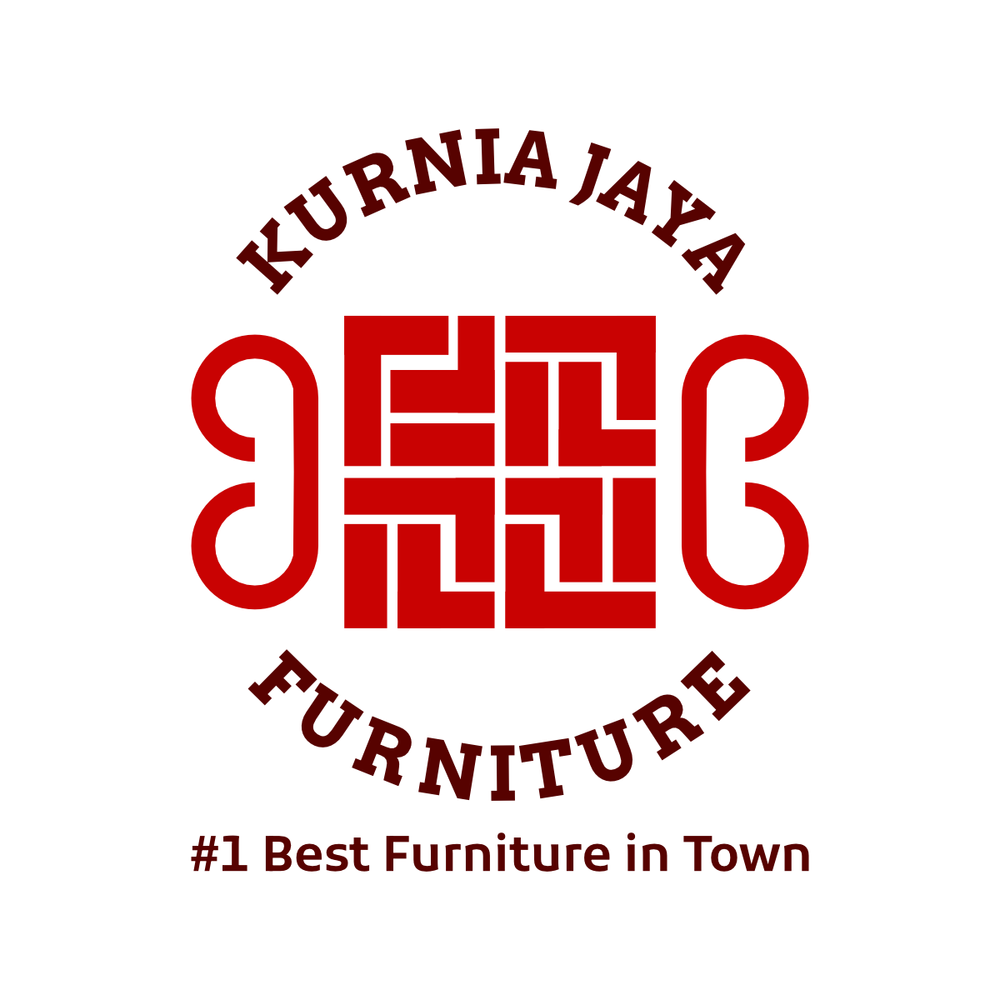

# 🪑 Kurnia Jaya Furniture

  

**Platform Online Marketplace Modern untuk Furniture Premium**

---

## 🌟 Tentang Project

Kurnia Jaya Furniture adalah platform online marketplace yang dikembangkan khusus untuk Toko Kurnia Jaya Furniture. Platform ini dirancang untuk meningkatkan skalabilitas bisnis dengan memberikan pengalaman berbelanja furniture yang modern, intuitif, dan seamless bagi pelanggan.

**Visi**: Menjadi platform furniture terdepan yang menghubungkan kebutuhan interior rumah dengan koleksi furniture berkualitas tinggi.

## ✨ Fitur Utama

### 🛍️ **Untuk Pelanggan**

-   **Katalog Produk Interaktif** - Browse furniture dengan tampilan yang menarik dan detail lengkap
-   **Pencarian & Filter Canggih** - Temukan furniture impian dengan mudah
-   **Wishlist Personal** - Simpan produk favorit untuk pembelian di masa depan
-   **Keranjang Belanja** - Kelola pembelian dengan sistem keranjang yang user-friendly
-   **Responsive Design** - Pengalaman optimal di desktop, tablet, dan mobile

### 🎨 **User Experience**

-   **Animasi Smooth** - Transisi halus menggunakan Framer Motion
-   **Interface Modern** - Desain clean dan professional dengan shadcn/ui
-   **Loading Cepat** - Optimasi performa dengan Vite bundler
-   **Real-time Updates** - Sinkronisasi data real-time dengan Supabase

### 🔧 **Untuk Admin**

-   **Dashboard Komprehensif** - Kelola inventori dan pesanan dengan mudah
-   **Manajemen Produk** - Upload, edit, dan kelola katalog furniture
-   **Analytics & Reporting** - Insight mendalam tentang performa toko

## 🚀 Tech Stack

| Technology        | Purpose              | Version |
| ----------------- | -------------------- | ------- |
| **React**         | Frontend Framework   | ^18.0.0 |
| **TypeScript**    | Type Safety          | ^5.0.0  |
| **Tailwind CSS**  | Styling Framework    | ^3.0.0  |
| **shadcn/ui**     | UI Component Library | Latest  |
| **Framer Motion** | Animation Library    | ^10.0.0 |
| **Zustand**       | State Management     | ^4.0.0  |
| **Vite**          | Build Tool           | ^4.0.0  |
| **Supabase**      | Backend as a Service | ^2.0.0  |

## 📋 Roadmap

### Q2 2025

-   [ ] **Payment Gateway Integration** - Integrasi dengan Midtrans
-   [ ] **Order Tracking System** - Sistem pelacakan pesanan real-time

## 🙏 Acknowledgments

-   **Tim Development** yang telah berdedikasi dalam mengembangkan platform ini
-   **Kurnia Jaya Furniture** atas kepercayaan untuk digitalisasi bisnis
-   **Open Source Community** untuk tools dan libraries amazing yang digunakan
-   **shadcn** untuk UI components yang beautiful dan accessible

---

**Dibuat dengan ❤️ oleh Tim Kurnia Jaya Furniture**

[🌐 Website](https://kurniajayafurniture.com) • [📧 Email](mailto:kurniajayafurniture888@gmail.com)

